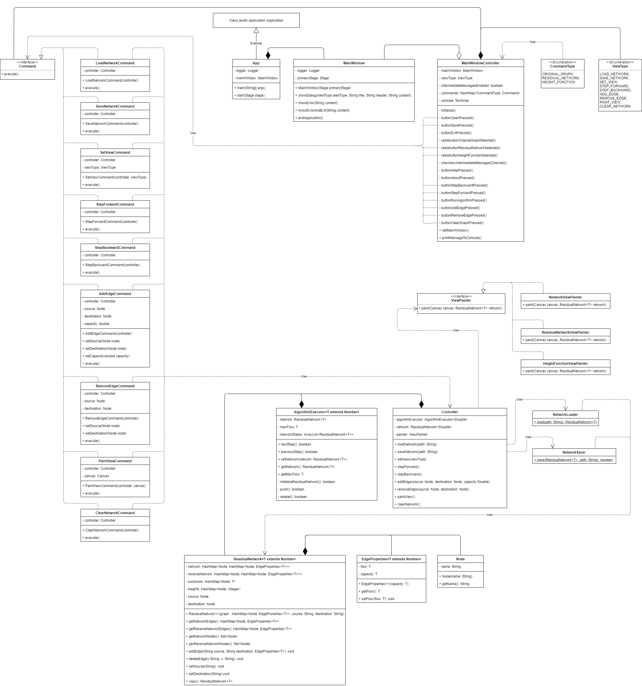
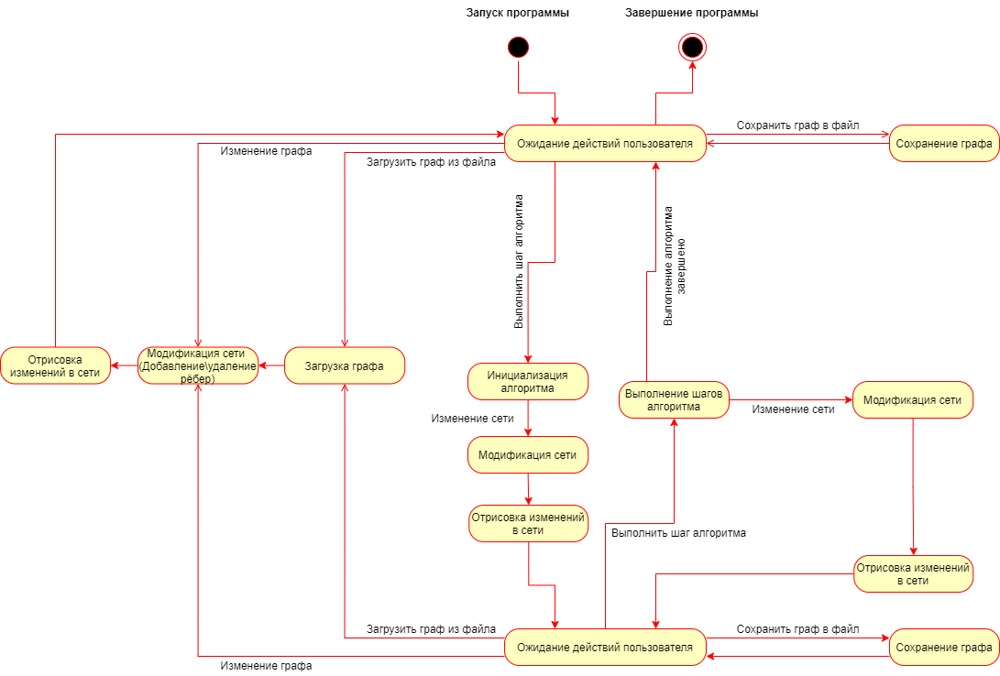
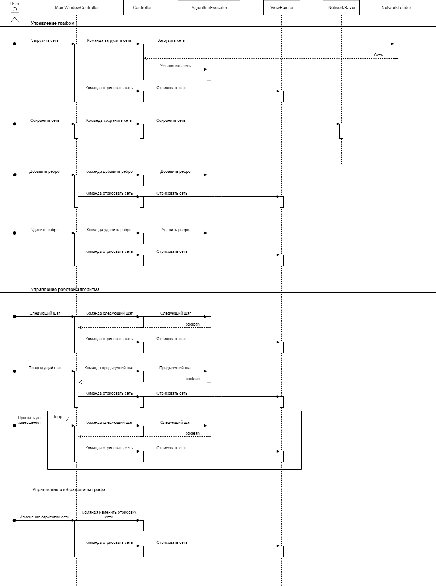

# Визуализация алгоритма Гольдберга

## Команда и распределение ролей

* [Шахин Никита 9381](https://github.com/shakhinn) - реализация алгоритма Гольдберга
* [Колованов Родион 9381](https://github.com/TheLifes08) - разработка GUI программы и визуализация алгоритма
* [Андрух Ирина 9381](https://github.com/Irina8888) - сборка и тестирование приложения

## План разработки

- [x] 1.06: Распределение ролей в бригаде;
- [x] 2.06: Создание репозитория для проекта и настройка системы автоматической сборки;
- [x] 4.06: Написание плана разработки и создание UML-диаграмм классов, состояний и последовательностей;
- [x] 5.06: Разработка прототипа: создание GUI без выполняемого функционала;
- [x] 6.06: Отчёт по результатам первой итерации;
- [x] 8.06: Реализация алгоритма Гольдберга, реализация частичного функционала GUI и тестирование;
- [x] 9.06: Отчёт по результатам второй итерации;
- [x] 10.06: Реализация взаимодействия с алгоритмом через GUI;
- [x] 11.06: Реализация визуализации сети;
- [ ] 12.06: Отчёт по результатам третьей итерации;
- [ ] 14.06: Реализация дополнительного функционала.

## Спецификация

**Диаграмма классов:**

**Диаграмма состояний:**

**Диаграмма последовательностей:**

